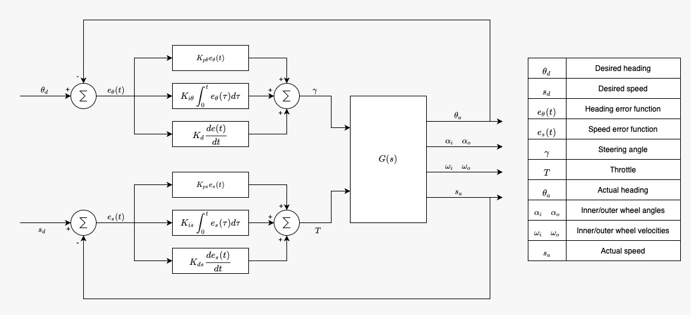
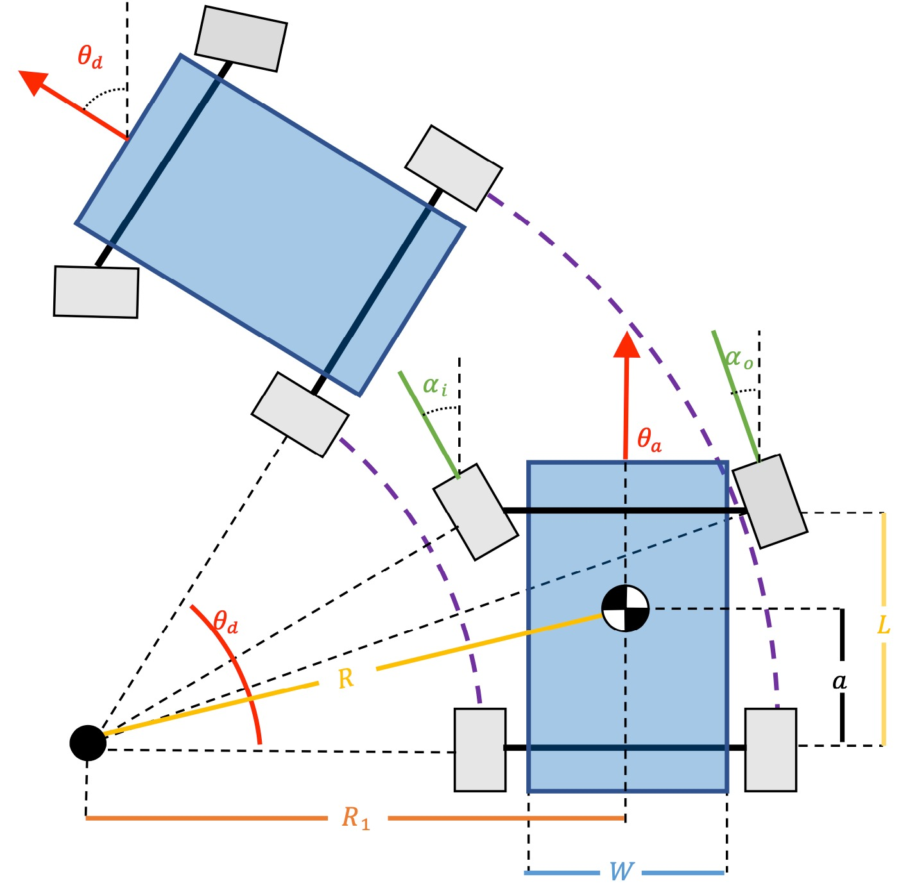

# Ackermann Steering Control
[](https://travis-ci.com/govindak-umd/Ackermann_Steering_Controller)
[](https://coveralls.io/github/govindak-umd/Ackermann_Steering_Controller?branch=master)
[](https://opensource.org/licenses/MIT)
---

## Authors

Sprint 1:
- Driver : Govind Ajithkumar
- Navigator : Pradeep Gopal
- Design Keeper : Justin Albrecht

Sprint 2:
 - Part 1 - Implementation of the code : 
     * Driver : Justin Albrecht
     * Navigator : Govind Ajithkumar
     * Design Keeper : Pradeep Gopal

## Overview
For this project we are going to implement a controller that uses the Ackermann kinematic steering equations for the Acme Robotics company. The Ackermann equations assume that a four wheeled vehicle travels around an instantaneous center of curvature and can compute the kinematics for given turning angles for both the inner and outer wheels. The basic idea behind Ackermann steering is that the inner wheel should steer for a bigger angle when compared to the outer wheel. This stops the wheels from slipping side ways when the vehicle follows a curved path. We are assuming that the controller is for a four wheeled robot with front-wheel steering and rear-wheel drive. 

The following assumptions are made while developing this project :-
 1. All vehicle parameters are known.
 2. The initial position, orientation and velocity of the vehicle are taken as user inputs.
 3. Desired position, orientation and velocity of the vehicle are given by user. 
 4. Friction, Wheel slippage and actuator saturation is minimal.
 5. The initial velocity is set to be zero i.e v = 0.
 6. The maximum steering angle is 45 degrees.
 
 ## Agile Iterative Process (AIP)
This project was completed using AIP with the involvement of 3 programmers using Pair-programming in turns. The detailed Product Backlog, Iteration Backlogs and Work Log are mentioned in the link given below :

[Agile Iterative Process](https://docs.google.com/spreadsheets/d/1mllm-lFvLnS9uENkift7FDs6RVxYKf9B1DdrZmD5e4E/edit#gid=0)

## Important Links
[Google Doc Link for Sprint Planning and notes](https://docs.google.com/document/d/1MYrVPlC8CS4HKTRGY48tLDCI4FuRGh4HkhqQqH0sPOc/edit?usp=sharing)

[ Youtube link to the video discussion](https://youtu.be/VMbhLwmguhI)

The Proposed Control system
<p align="center">
  
</p>

Ackermann Steering

<p align="center">
  
</p>

## To-do tasks for pair programming (Driver-Navigator-Design Keeper discussion)
- [x] Create UML Class and Activity diagram.
- [x] Create Google docs for meeting reflections. 
- [x] Create code stubs based on the UML class diagram.
- [x] Update UML diagrams with changes in implementation.
- [x] Write Unit Test cases for testing and check the test cases to ensure all possible scenarios are covered.
- [x] Generate Doxygen comments in the code
- [ ] Develop the code for the project while following C++11 coding guidelines.
- [ ] Check for design issues in the code
- [ ] Perform testing and fix defects if any.
- [ ] Run cpplint and cppcheck as part of Sprint 2.
- [ ] Run Valgrind to detect memory leaks. Fix all detected memory leaks.
- [ ] Generate Doxygen documentation in the docs folder.
- [ ] Make sure that the repository is updated with all delivarables as mentioned in the proposal.

## Standard install via command-line
```
git clone --recursive https://github.com/Gautam-Balachandran/SoftwareDev-MIDTERM
cd <path to repository>
mkdir build
cd build
cmake ..
make
Run tests: ./test/cpp-test
Run program: 
```

## Building for code coverage 
```
sudo apt-get install lcov
cmake -D COVERAGE=ON -D CMAKE_BUILD_TYPE=Debug ../
make
make code_coverage
```
This generates a index.html page in the build/coverage sub-directory that can be viewed locally in a web browser.

## Working with Eclipse IDE ##

## Installation

In your Eclipse workspace directory (or create a new one), checkout the repo (and submodules)
```
mkdir -p ~/workspace
cd ~/workspace
git clone --recursive https://github.com/Gautam-Balachandran/SoftwareDev-MIDTERM
```

In your work directory, use cmake to create an Eclipse project for an [out-of-source build] of SoftwareDev-MIDTERM

```
cd ~/workspace
mkdir -p SoftwareDev-MIDTERM
cd SoftwareDev-MIDTERM
cmake -G "Eclipse CDT4 - Unix Makefiles" -D CMAKE_BUILD_TYPE=Debug -D CMAKE_ECLIPSE_VERSION=4.7.0 -D CMAKE_CXX_COMPILER_ARG1=-std=c++14 ../SoftwareDev-MIDTERM/
```

## Import

Open Eclipse, go to File -> Import -> General -> Existing Projects into Workspace -> 
Select "SoftwareDev-MIDTERM" directory created previously as root directory -> Finish

# Edit

Source files may be edited under the "[Source Directory]" label in the Project Explorer.


## Build

To build the project, in Eclipse, unfold SoftwareDev-MIDTERM project in Project Explorer,
unfold Build Targets, double click on "all" to build all projects.

## Run

1. In Eclipse, right click on the SoftwareDev-MIDTERM in Project Explorer,
select Run As -> Local C/C++ Application

2. Choose the binaries to run (e.g. SoftwareDev-MIDTERM, cpp-test for unit testing)


## Debug


1. Set breakpoint in source file (i.e. double click in the left margin on the line you want 
the program to break).

2. In Eclipse, right click on the boilerplate-eclipse in Project Explorer, select Debug As -> 
Local C/C++ Application, choose the binaries to run (e.g. SoftwareDev-MIDTERM).

3. If prompt to "Confirm Perspective Switch", select yes.

4. Program will break at the breakpoint you set.

5. Press Step Into (F5), Step Over (F6), Step Return (F7) to step/debug your program.

6. Right click on the variable in editor to add watch expression to watch the variable in 
debugger window.

7. Press Terminate icon to terminate debugging and press C/C++ icon to switch back to C/C++ 
perspetive view (or Windows->Perspective->Open Perspective->C/C++).


## Plugins

- CppChEclipse

    To install and run cppcheck in Eclipse

    1. In Eclipse, go to Window -> Preferences -> C/C++ -> cppcheclipse.
    Set cppcheck binary path to "/usr/bin/cppcheck".

    2. To run CPPCheck on a project, right click on the project name in the Project Explorer 
    and choose cppcheck -> Run cppcheck.


- Google C++ Sytle

    To include and use Google C++ Style formatter in Eclipse

    1. In Eclipse, go to Window -> Preferences -> C/C++ -> Code Style -> Formatter. 
    Import [eclipse-cpp-google-style][reference-id-for-eclipse-cpp-google-style] and apply.

    2. To use Google C++ style formatter, right click on the source code or folder in 
    Project Explorer and choose Source -> Format

[reference-id-for-eclipse-cpp-google-style]: https://raw.githubusercontent.com/google/styleguide/gh-pages/eclipse-cpp-google-style.xml

- Git

    It is possible to manage version control through Eclipse and the git plugin, but it typically requires creating another project.

## Doxygen

Doxygen is a tool used for generating software reference documentation.

To install it use 
```
sudo apt install doxygen
```
To generate doxygen documentation after installation use 
```
doxygen -g <config-file>
```
where ```<config-file>``` is the name of the configuration file that you want to create. 
In this file edit the input and output directories, and the files that have to be included or excluded while generating the Doxygen comments.
Finally, to run the Doxygen configuration file, use the following command
 ```
doxygen <config-file>
 ```
This will generate a HTML and LATEX output of the Doxygen comments inside the output directory specified in the configuration file.
 
## License
```
Permission is hereby granted, free of charge, to any person obtaining a copy of this software and associated documentation files (the "Software"), to deal in the Software without restriction, including without limitation the rights to use, copy, modify, merge, publish, distribute, sublicense, and/or sell copies of the Software, and to permit persons to whom the Software is furnished to do so, subject to the following conditions:

The above copyright notice and this permission notice shall be included in all copies or substantial portions of the Software.

THE SOFTWARE IS PROVIDED "AS IS", WITHOUT WARRANTY OF ANY KIND, EXPRESS OR IMPLIED, INCLUDING BUT NOT LIMITED TO THE WARRANTIES OF MERCHANTABILITY, FITNESS FOR A PARTICULAR PURPOSE AND NONINFRINGEMENT. IN NO EVENT SHALL THE AUTHORS OR COPYRIGHT HOLDERS BE LIABLE FOR ANY CLAIM, DAMAGES OR OTHER LIABILITY, WHETHER IN AN ACTION OF CONTRACT, TORT OR OTHERWISE, ARISING FROM, OUT OF OR IN CONNECTION WITH THE SOFTWARE OR THE USE OR OTHER DEALINGS IN THE SOFTWARE.

